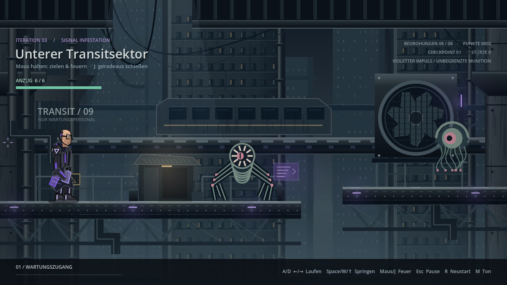

# Godot-Spiel mit KI-Agent bauen – Starter-Template

Dieses Repository ist eine Vorlage, mit der du ein komplettes 2D-Godot-Spiel
in drei Iterationen baust – zusammen mit einem KI-Coding-Agenten (z. B.
OpenCode) und einem Chatmodell (z. B. ChatGPT) für Artwork. Der Mensch
formuliert Ziele und bewertet das spielbare Ergebnis, der Agent setzt direkt
im Repository um.

Als lauffähiges Beispiel liegt das Cyberpunk-Jump-&-Run **Signal Infestation**
bei (`dist/level1/`): Laufen, Springen, Zielen und Schießen, acht Gegner,
Boss, Punkte, Pause und Neustart.



> **Anleitung im Browser:** Von WSL-Setup bis 1. Iteration –
> [Begleit-Website](https://orchid-mirage-rpab.here.now/) (lokal: `./start-website.sh`).

## Der Flow in drei Iterationen

| Schritt | Ordner | Inhalt |
| --- | --- | --- |
| 1. Art-Grundlage | `1st_iter/` | Charakter-Referenzen, Palette, Art-Direction, Environment-Prompt, Produktionsordner |
| 2. Spielbar machen | `2nd_iter/` | Gameplay-Brief (`GAMEPLAY.md`), Charakter-Brief (`CHARACTER.md`) |
| 3. Echtes Spiel | `3rd_iter/` | Gegner-Design (`ENEMIES.md`), Schießen, Boss, Punkte, Sieg/Niederlage |
| Ergebnis | `dist/level1/` | Eigenständiges Godot-Projekt, per `tools/export-windows.sh` als Windows-exe exportierbar |

Jede Iteration beginnt mit einem **Brief als Markdown** (Was soll es werden?),
danach implementiert der Agent. Details stehen in den `README.md`-Dateien der
jeweiligen Ordner.

## Schnellstart

Voraussetzungen: WSL (Linux-Dateisystem, nicht `/mnt/c/...`), Godot 4.7.2 als
Linux-Binary, Node.js/npm und OpenCode. Ausführlich: `README_SETUP.md`.

```bash
cp .env.example .env            # OPENROUTER_API_KEY eintragen (.env nie committen!)
./tools/check-project.sh        # Projekt headless prüfen
./start-opencode.sh             # OpenCode starten
```

Danach den Text aus `ERSTER_AUFTRAG.md` in OpenCode einfügen. Regeln für den
Agenten: `AGENTS.md`, Spielziel: `GAME_SPEC.md`, aktueller Stand:
`AGENT_HANDOFF.md`.

Beispielspiel direkt starten:

```bash
./dist/level1/tools/godot.sh   # oder dist/level1/project.godot importieren, F5
```

Steuerung dort: A/D laufen, Space/W springen, Maus halten zum Zielen und
Feuern (J schießt geradeaus), Esc Pause, R Neustart.

## Eigenes Spiel starten

1. Neuen Brief schreiben (Setting, Levelaufbau, Elemente) – Vorlage:
   `level1.md`.
2. Art-Direction festlegen – Vorlage: `1st_iter/docs/art/ART_DIRECTION.md`.
3. Charakter/Gegner per Chatmodell entwerfen – Anleitung: `docs/ASSETS.md`.
4. Gameplay-Brief formulieren – Vorlage: `2nd_iter/GAMEPLAY.md`.
5. Gegner-Brief formulieren – Vorlage: `3rd_iter/ENEMIES.md`.
6. Dem Agenten die drei Briefs der Reihe nach geben, jeweils spielen,
   bewerten, nachschärfen.
7. Exportieren: `./tools/export-windows.sh <level>` – legt `exe + pck` nach
   `build/windows/<level>/` und kopiert sie auf die Windows-Seite
   (`/mnt/c/gamedev_astra/dist/<level>/`). Einmalig sind Export-Templates
   nötig (im Editor: Editor -> Manage Export Templates).

## Assets

Alle Grafiken und Sounds hier sind entweder im Projekt erzeugt oder mit
Chatmodellen entworfen – keine gekauften Packs nötig. Wie das geht, welche
Prompts funktionieren und wo die Beispiele liegen: **`docs/ASSETS.md`**.
Herkunft jedes Assets steht in den `CREDITS.md`-Dateien (`assets/`,
`dist/level1/assets/`).

## Doku-Übersicht

- `website/` – Begleit-Website (Start: `./start-website.sh`), Anleitung von WSL bis Iteration 1 mit allen Verlinkungen
- `README_SETUP.md` – WSL-Setup im Detail
- `docs/ASSETS.md` – Assets mit ChatGPT & Co. erstellen
- `docs/PUBLISH.md` – Checkliste für GitHub (was committen, was nicht)
- `GAME_SPEC.md` – verbindliche Spielregeln
- `AGENTS.md` – Arbeitsweise des Agenten
- `AGENT_HANDOFF.md` – aktueller Stand für den nächsten Agenten
- `ERSTER_AUFTRAG.md`, `2_AUFTRAG.md` – Startaufträge zum Einfügen

## Enthaltenes Beispiel 1: Neon Rush (Root-Projekt)

Das Root-Projekt ist ein separates, älteres Beispiel: Cyberpunk-Jump-&-Run
mit drei Leveln, Menüs und Speicherung. Start: `godot` im Projektordner,
Hauptszene `scenes/menu/main_menu.tscn`. Assets dafür erzeugen
`tools/generate_assets.py` und `tools/generate_audio.py` (Quellen und
Lizenzen in `assets/CREDITS.md`).

## Sicherheit

`.env` (API-Key) ist per `.gitignore` ausgeschlossen und für den Agenten
gesperrt, ebenso `git push`, `git reset --hard` und `rm -rf`. Vor dem
Veröffentlichen unbedingt `docs/PUBLISH.md` lesen.
